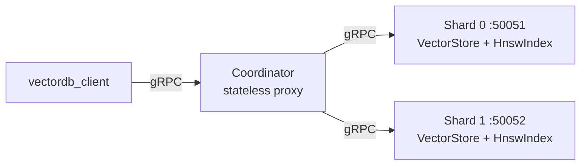

# VectorDB-DS


A distributed vector database built from scratch in modern C++ — no vector-search
libraries, no ORM, no framework. The HNSW index, the storage engine, the hash
partitioner and the scatter-gather query planner are all implemented here.

It demonstrates high-performance systems programming, approximate nearest-neighbour
search, gRPC networking, distributed query execution, and cloud-native orchestration
with Docker and Kubernetes.

## Results

Brute-force vs. the hand-written HNSW index, measured on 50,000 SIFT-128 vectors,
k = 10, 100 queries, `M=16 / ef_construction=200 / ef_search=50`:

| Metric | Brute force | HNSW |
|---|---|---|
| Mean query latency | 3.679 ms | **0.155 ms** |
| Speedup | 1× | **23.7×** |
| recall@10 | 1.000 (ground truth) | **0.973** |
| Index build time | — | 19.27 s (one-off) |

At this operating point HNSW returns 9.73 of the 10 true nearest neighbours while
touching roughly 850 nodes instead of scanning all 6.4 million floats per query.
Most production ANN systems target recall ≥ 0.95.

Numbers above come from a recorded SIFT-1M run — see
[docs/benchmark.md](docs/benchmark.md) for the full walkthrough and how to
reproduce it. Without the dataset the benchmark falls back to synthetic uniform
vectors, which have no cluster structure and score far lower (~0.46 recall) —
that is a property of random data, not of the index.

## Quick start

```bash
docker compose up --build -d          # 2 shards + 1 coordinator
cmake -S . -B build -DCMAKE_BUILD_TYPE=Release && cmake --build build --parallel
./build/vectordb_client localhost:50050
```

That upserts five vectors through the coordinator, runs a top-3 search, overwrites
one vector, and searches again. `docker compose down` tears it back down.

## Architecture



**Shards** are stateful gRPC servers, each holding a partitioned subset of vectors
in memory with a local HNSW index.

**The Coordinator** is a stateless proxy. It routes each upsert to exactly one
shard (FNV-1a hash of the vector ID), and fans every search out to all shards
concurrently with `std::async`, then merges the partial top-k lists into a global
top-k.

The client talks to the coordinator using the same `VectorDBService` proto that the
shards implement — it is unaware there are shards behind it. Results are identical
whether the client is pointed at a single shard or at the coordinator.

## API

The full contract is [proto/vectordb.proto](proto/vectordb.proto) — two RPCs:

```protobuf
service VectorDBService {
  // id + vector -> created: true if inserted, false if an existing id was overwritten
  rpc Upsert(UpsertRequest) returns (UpsertResponse);

  // query vector + k -> results sorted ascending by Euclidean distance
  rpc Search(SearchRequest) returns (SearchResponse);
}
```

Dimensionality is fixed by the first vector inserted; later vectors of a different
size are rejected with `INVALID_ARGUMENT`.

## Project structure

```
VectorDB-DS/
├── proto/
│   └── vectordb.proto          # gRPC service definition (Upsert + Search)
├── include/
│   ├── math_vector.h           # RAII float vector (Rule of Five)
│   ├── vector_store.h          # ID-addressed vector storage
│   ├── brute_force_index.h     # Exact k-NN (O(N·D) per query)
│   ├── hnsw_index.h            # HNSW ANN index (O(log N) per query)
│   └── partitioner.h           # FNV-1a hash-based shard assignment
├── src/
│   ├── math_vector.cpp
│   ├── vector_store.cpp
│   ├── brute_force_index.cpp
│   ├── hnsw_index.cpp
│   ├── server.cpp              # Shard: gRPC server wrapping the engine
│   ├── coordinator.cpp         # Coordinator: scatter-gather proxy
│   └── client.cpp              # gRPC client demo
├── tests/
│   └── test_main.cpp           # Unit test suite
├── bench/
│   └── bench_main.cpp          # Brute-force vs HNSW benchmark
├── k8s/                        # namespace, configmap, StatefulSet, Deployment, Services
├── docs/
│   ├── benchmark.md            # HNSW benchmark guide (SIFT-1M dataset)
│   └── deployment.md           # Docker and Kubernetes deployment guide
├── data/                       # (gitignored) SIFT .fvecs files for the benchmark
├── Dockerfile                  # Multi-stage: builder → shard / coordinator
├── docker-compose.yml          # 2 shards + coordinator (one command)
└── CMakeLists.txt
```

## Prerequisites

- CMake ≥ 3.15
- C++17-capable compiler (clang++ or g++)
- gRPC and Protobuf
- Docker (optional, for the containerised run)

**Anaconda** (what this project uses — `CMakeLists.txt` already adds
`$HOME/anaconda3` to `CMAKE_PREFIX_PATH`):

```bash
conda install -c conda-forge grpc-cpp protobuf
```

**Homebrew** alternative — pass the prefix explicitly at configure time:

```bash
brew install grpc protobuf
cmake -S . -B build -DCMAKE_BUILD_TYPE=Release -DCMAKE_PREFIX_PATH="$(brew --prefix)"
```

## Build

```bash
cmake -S . -B build -DCMAKE_BUILD_TYPE=Release
cmake --build build --parallel
```

Always configure with `-DCMAKE_BUILD_TYPE=Release`. CMake's default is an
unoptimised build, and the benchmark numbers are meaningless without `-O3`.
(The test binary is compiled with `-UNDEBUG` so its assertions stay live even in
a Release build.)

This produces five binaries in `build/`:

| Binary | Description |
|--------|-------------|
| `vectordb_tests` | Unit test suite — MathVector, VectorStore, brute force, HNSW, partitioner |
| `vectordb_bench` | Brute-force vs HNSW latency and recall benchmark |
| `vectordb_server` | Shard server — gRPC server with HNSW engine (default port 50051) |
| `vectordb_coordinator` | Coordinator — scatter-gather proxy over multiple shards |
| `vectordb_client` | Demo client that upserts vectors and runs searches |

## Run

### Tests

```bash
./build/vectordb_tests
```

Covers constructors, the Rule of Five (including self-assignment), element access,
iterators, Euclidean distance, `VectorStore` insert/upsert and its error paths,
brute-force search, HNSW graph construction, the layer hierarchy, HNSW recall, and
the partitioner. Exits non-zero on the first failed assertion.

### Benchmark

```bash
./build/vectordb_bench
```

Runs with the SIFT dataset if `data/sift_base.fvecs` is present, and falls back to
synthetic vectors otherwise — no download required to try it.
See [docs/benchmark.md](docs/benchmark.md) for the dataset setup and a walkthrough
of every number in the output.

### Single-node mode

In one terminal:

```bash
./build/vectordb_server            # listens on 0.0.0.0:50051
./build/vectordb_server 50052      # custom port
```

In a second terminal:

```bash
./build/vectordb_client            # connects to localhost:50051
./build/vectordb_client host:port  # custom address
```

### Distributed mode (scatter-gather)

Start two shards and the coordinator:

```bash
# Terminal 1 — Shard 0
./build/vectordb_server 50051

# Terminal 2 — Shard 1
./build/vectordb_server 50052

# Terminal 3 — Coordinator
./build/vectordb_coordinator 50050 localhost:50051 localhost:50052

# Terminal 4 — Client (talks to coordinator)
./build/vectordb_client localhost:50050
```

The coordinator hashes each vector ID to determine which shard receives it. On
search, it queries all shards in parallel and merges the results:

```
Connecting to localhost:50050...

[1] Inserting vectors
  Upserted 'a' — created
  Upserted 'b' — created
  Upserted 'c' — created
  Upserted 'd' — created
  Upserted 'e' — created

[2] Searching for nearest to (2.1, 2.1), k=3
  Top-3 results:
    id="b"  distance=0.141421
    id="c"  distance=1.27279
    id="a"  distance=1.55563

[3] Overwriting 'b' to (4.9, 4.9)
  Upserted 'b' — updated

[4] Searching again for nearest to (2.1, 2.1), k=3
  Top-3 results:
    id="c"  distance=1.27279
    id="a"  distance=1.55563
    id="d"  distance=2.68701
```

The results are identical whether the client talks to a single shard or the
distributed coordinator — the scatter-gather merge produces the same global top-k.

### Docker Compose

```bash
docker compose up --build -d      # 2 shards + coordinator on a Docker network
./build/vectordb_client localhost:50050
docker compose down
```

### Kubernetes

Manifests for a StatefulSet of shards behind a headless Service, plus a stateless
coordinator Deployment exposed on a NodePort, live in `k8s/`.
Full walkthrough — kind cluster, image loading, port-forwarding, logs, teardown —
is in [docs/deployment.md](docs/deployment.md).

## Design decisions

**Why a custom `MathVector` instead of `std::vector<float>`?**
To own the memory explicitly and implement the Rule of Five by hand — the copy/move
semantics are the point of the exercise. It also keeps vector data contiguous and
free of the `std::vector<std::vector<float>>` pointer-chasing that destroys cache
locality in a distance loop.

**Why HNSW?**
Brute force is O(N·D) per query — 6.4 M float operations at N=50 K, D=128. HNSW
trades a one-off build cost and some recall for roughly O(log N) search by walking
a multi-layer proximity graph, coarse layers first. The benchmark keeps the
brute-force index alongside it precisely so recall can be measured against exact
ground truth rather than asserted.

**Why FNV-1a for partitioning rather than `std::hash`?**
`std::hash` is not specified to be stable across implementations or runs, so a
coordinator and a shard built with different standard libraries could disagree
about where a vector lives. FNV-1a is a fixed, portable algorithm — the same ID
always maps to the same shard, and the test suite pins two known digests.

**Why `std::async` for the scatter, rather than gRPC's async API?**
The fan-out is bounded by the shard count, so a thread per shard costs almost
nothing and the code stays linear and readable. A completion-queue-based async
client would be the right call at hundreds of shards; at two it would be
complexity without benefit.

**Why is the coordinator stateless?**
It holds no vectors and no index — only shard addresses. That makes it trivially
horizontally scalable and lets Kubernetes model it as a plain Deployment while the
shards, which own data, get a StatefulSet with stable network identity.

## Limitations

Deliberately out of scope — this is a systems-programming project, not a
production database:

- **No persistence.** All vectors live in memory; a restart loses the index. There is no WAL and no snapshot/restore.
- **No replication or fault tolerance.** If a shard dies, its slice of the data is gone and searches silently return fewer results.
- **Fixed shard count.** Adding a shard rehashes every ID. Consistent hashing would be the fix.
- **No deletes.** The API is upsert and search only.
- **Euclidean distance only.** No cosine or inner product.
- **No authentication, TLS, or rate limiting.** The gRPC endpoints are wide open.
- **Single-vector requests.** No batched upsert, which caps ingest throughput.
- **Index rebuilt on every insert path** rather than supporting concurrent readers during writes.

## Roadmap

- [x] **Chapter 1** — Core foundation: `MathVector`, RAII memory management, brute-force k-NN
- [x] **Chapter 2** — HNSW index: multi-layer graph, greedy traversal, recall measurement
- [x] **Chapter 3** — Network layer: `.proto` contract, generated stubs, gRPC server and client
- [x] **Chapter 4** — Distributed scatter-gather: hash partitioning and the coordinator
- [x] **Chapter 5** — Cloud-native orchestration: multi-stage Dockerfile, Kubernetes manifests
- [ ] Index persistence (serialise/load the HNSW graph)
- [ ] Consistent hashing so shards can be added without a full rehash
- [ ] Batched upsert and cosine distance

## Development

1. Add headers to `include/`, source files to `src/`
2. Register new `.cpp` files in `CMakeLists.txt` under the appropriate target
3. The proto file is at `proto/vectordb.proto` — edit it and CMake will regenerate the C++ stubs automatically on the next build
4. Rebuild from the project root: `cmake --build build`
5. Run `./build/vectordb_tests` before committing

## License

MIT — see [LICENSE](LICENSE).
